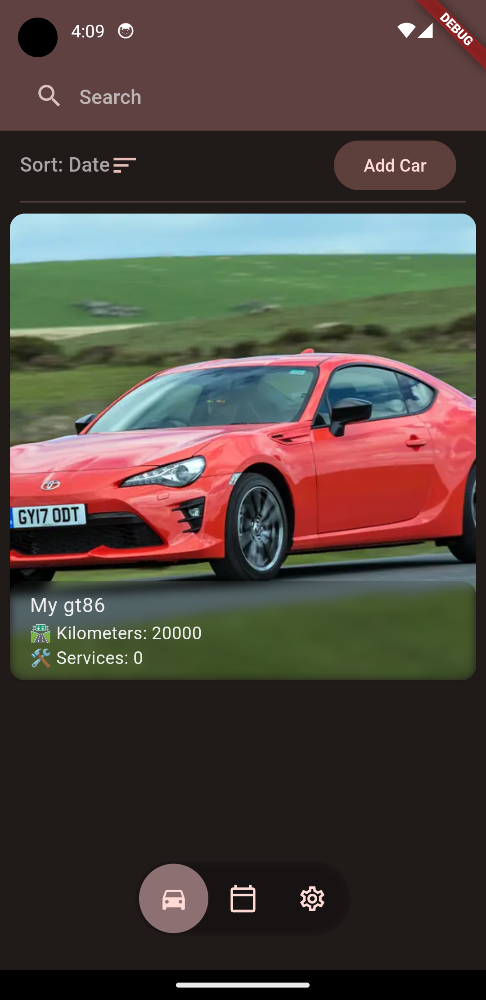
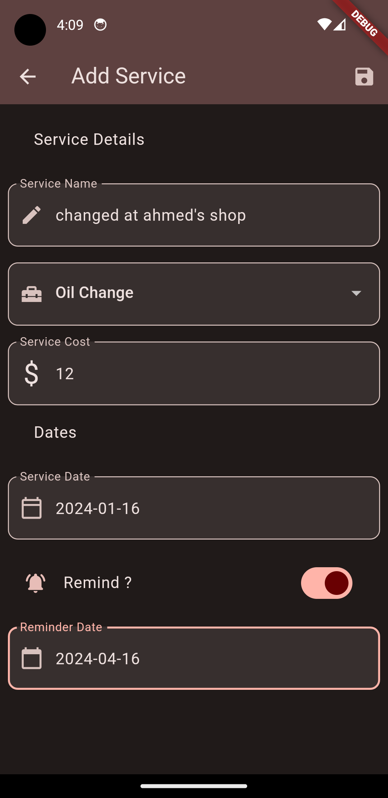
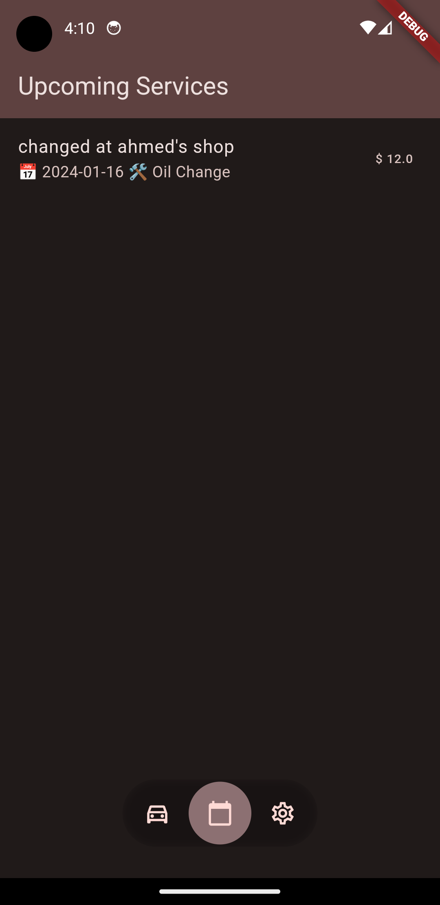
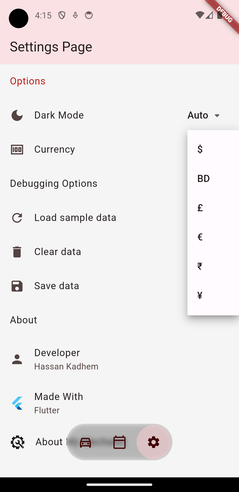

# MyMechanic

A new Flutter application to help you keep up with your car maintenance.

this application has the following features
- add multiple cars with an image for each one
- modify car details
- add services to the car as they are made
- can add a reminder for the next service
- has a page which shows all the upcoming reminders
- change the currency used across the app
- light mode, dark mode or auto based on os choice

Home page

adding a service with a reminder

Upcoming reminders

Currency choices
